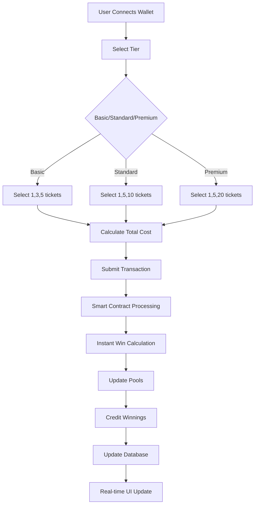
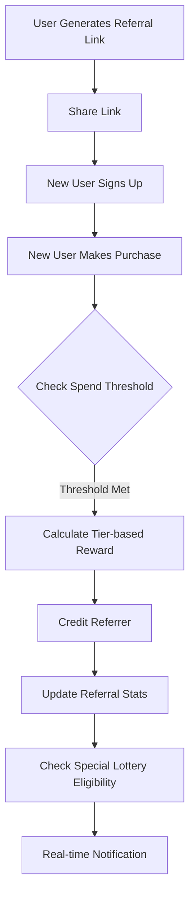
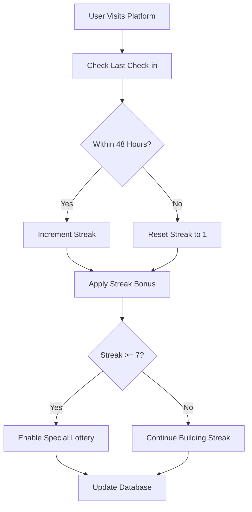

# 🏗️ ChainLuck Architecture

## Overview

ChainLuck is a sophisticated multi-tier decentralized lottery platform built on blockchain technology, offering instant-result lotteries across three user segments with transparent odds, immediate payouts, and comprehensive engagement systems.

## System Architecture

```bash
┌─────────────────────────────────────────────────────────┐
│                     Frontend (Next.js)                   │
│  ┌─────────────┐  ┌──────────────┐  ┌──────────────┐  │
│  │   Next.js   │  │  RainbowKit  │  │   Wagmi      │  │
│  │   App Dir   │  │   Wallets    │  │  Contracts   │  │
│  │ Multi-Tier  │  │ Multi-Chain  │  │ Tier System  │  │
│  └─────────────┘  └──────────────┘  └──────────────┘  │
└─────────────────────────┬───────────────────────────────┘
                          │
                          ▼
┌─────────────────────────────────────────────────────────┐
│                    Blockchain Layer                      │
│  ┌─────────────┐  ┌──────────────┐  ┌──────────────┐  │
│  │  ChainLuck  │  │ Multi-Chain  │  │   Polygon    │  │
│  │Multi-Tier   │  │ Deployment   │  │     BSC      │  │
│  │  Contract   │  │   Strategy   │  │   Arbitrum   │  │
│  └─────────────┘  └──────────────┘  └──────────────┘  │
└─────────────────────────┬───────────────────────────────┘
                          │
                          ▼
┌─────────────────────────────────────────────────────────┐
│                   Backend Services                       │
│  ┌─────────────┐  ┌──────────────┐  ┌──────────────┐  │
│  │  Supabase   │  │     Edge     │  │  Real-time   │  │
│  │Multi-Tier   │  │  Functions   │  │   Events     │  │
│  │  Database   │  │   Lottery    │  │  Analytics   │  │
│  └─────────────┘  └──────────────┘  └──────────────┘  │
└─────────────────────────────────────────────────────────┘
```

## Technology Stack

### Frontend Layer

- **Framework**: Next.js 15.3.4 with App Router
- **Language**: TypeScript 5.x
- **Styling**: TailwindCSS v4 + shadcn/ui components
- **State Management**: React Context + Local State
- **Internationalization**: next-intl (English/Farsi)
- **Web3 Integration**:
  - Wagmi v2 for multi-chain contract interactions
  - RainbowKit for wallet connections across networks
  - Viem for blockchain utilities

### Blockchain Layer

- **Networks**: Multi-chain deployment (Polygon, BSC, Arbitrum)
- **Smart Contract**: Solidity 0.8.20 with multi-tier architecture
- **Development**: Hardhat Framework with cross-chain support
- **Randomness**: Enhanced pseudo-random with Chainlink VRF (optional)
- **Contract Features**:
  - Three-tier ticket purchase system ($1, $2, $5)
  - Dynamic package sizing per tier
  - Referral system with tier-based rewards
  - Daily check-in and streak tracking
  - Special lottery pools and tournaments
  - Multi-chain prize pool management

### Backend Services

- **Database**: Supabase PostgreSQL with multi-tier schema
- **Edge Functions**: Supabase Edge Functions for:
  - Blockchain event synchronization
  - Referral processing
  - Daily check-in management
  - Special lottery operations
- **Real-time**: Supabase Realtime for live updates
- **Analytics**: Comprehensive user behavior tracking

## Multi-Tier System Architecture

### User Progression Flow

```bash
┌─────────────┐    ┌─────────────┐    ┌─────────────┐
│ BASIC TIER  │───▶│STANDARD TIER│───▶│PREMIUM TIER │
│   $1-5      │    │   $2-20     │    │   $5-100    │
│             │    │             │    │             │
│High Frequency│    │ Balanced    │    │High Value   │
│Low Stakes   │    │Risk/Reward  │    │VIP Experience│
└─────────────┘    └─────────────┘    └─────────────┘
```

### Component Architecture

```bash
src/components/
├── auth/                    # Wallet authentication
│   ├── LoginPrompt.tsx     # Multi-chain wallet prompt
│   └── ProtectedRoute.tsx  # Route protection
├── common/                 # Shared UI components
│   ├── Header.tsx         # Multi-tier navigation
│   ├── Footer.tsx         # Platform links
│   └── LanguageSelector.tsx
├── dashboard/              # User dashboard views
│   ├── UserStats.tsx      # Tier-specific statistics
│   ├── WinHistory.tsx     # Historical win data
│   ├── ReferralPanel.tsx  # Tier-based referral system
│   └── ActivityFeed.tsx   # Real-time activity
├── lottery/                # Game mechanics UI
│   ├── TierSelector.tsx   # NEW: Tier selection
│   ├── PackageSelector.tsx # NEW: Package selection per tier
│   ├── PurchaseFlow.tsx   # Enhanced multi-tier flow
│   ├── WinAnimation.tsx   # Tier-specific animations
│   ├── LiveStats.tsx      # Real-time platform stats
│   ├── PoolStatus.tsx     # Multi-tier pool status
│   └── SpecialLotteries.tsx # NEW: Special lottery UI
├── engagement/             # NEW: Engagement systems
│   ├── DailyCheckIn.tsx   # Daily check-in interface
│   ├── StreakCounter.tsx  # Streak tracking
│   ├── ReferralDashboard.tsx # Comprehensive referral system
│   └── SpecialLotteryCard.tsx # Special lottery cards
├── providers/              # React context providers
│   ├── WalletProvider.tsx # Multi-chain wallet context
│   ├── UserProvider.tsx   # Enhanced user state
│   ├── TierProvider.tsx   # NEW: Tier management
│   └── SupabaseProvider.tsx
├── stats/                  # Analytics displays
│   ├── GlobalStats.tsx    # Platform-wide statistics
│   ├── TierAnalytics.tsx  # NEW: Tier-specific analytics
│   └── PoolAnalytics.tsx  # Pool performance
└── ui/                     # shadcn/ui primitives
    └── [40+ components]
```

## Data Flow Architecture

### Multi-Tier Ticket Purchase Flow



### Referral System Flow



### Daily Check-in Flow



## Database Schema Architecture

### Core Tables

```sql
-- Enhanced Users table with tier tracking
CREATE TABLE users (
  id UUID DEFAULT gen_random_uuid() PRIMARY KEY,
  wallet_address VARCHAR(42) UNIQUE NOT NULL,
  preferred_tier INTEGER DEFAULT 0, -- 0=Basic, 1=Standard, 2=Premium
  total_spent_basic DECIMAL(12,2) DEFAULT 0,
  total_spent_standard DECIMAL(12,2) DEFAULT 0,
  total_spent_premium DECIMAL(12,2) DEFAULT 0,
  total_won_basic DECIMAL(12,2) DEFAULT 0,
  total_won_standard DECIMAL(12,2) DEFAULT 0,
  total_won_premium DECIMAL(12,2) DEFAULT 0,
  referral_count INTEGER DEFAULT 0,
  current_streak INTEGER DEFAULT 0,
  last_checkin TIMESTAMP,
  created_at TIMESTAMP DEFAULT NOW(),
  updated_at TIMESTAMP DEFAULT NOW()
);

-- Enhanced Tickets table with tier information
CREATE TABLE tickets (
  id UUID DEFAULT gen_random_uuid() PRIMARY KEY,
  user_id UUID REFERENCES users(id),
  tier INTEGER NOT NULL, -- 0=Basic, 1=Standard, 2=Premium
  ticket_count INTEGER NOT NULL,
  total_cost DECIMAL(10,2) NOT NULL,
  guaranteed_win DECIMAL(10,2) DEFAULT 0,
  bonus_win DECIMAL(10,2) DEFAULT 0,
  win_tier_level INTEGER DEFAULT 0, -- 0=guaranteed, 1=small, 2=medium, etc.
  tx_hash VARCHAR(66),
  block_number BIGINT,
  created_at TIMESTAMP DEFAULT NOW()
);

-- Referral system with tier-based rewards
CREATE TABLE referrals (
  id UUID DEFAULT gen_random_uuid() PRIMARY KEY,
  referrer_id UUID REFERENCES users(id),
  referred_id UUID REFERENCES users(id),
  tier INTEGER NOT NULL,
  spend_threshold DECIMAL(10,2) NOT NULL,
  reward_amount DECIMAL(10,2) NOT NULL,
  status VARCHAR(20) DEFAULT 'pending',
  processed_at TIMESTAMP,
  created_at TIMESTAMP DEFAULT NOW()
);

-- Daily check-ins and streaks
CREATE TABLE daily_checkins (
  id UUID DEFAULT gen_random_uuid() PRIMARY KEY,
  user_id UUID REFERENCES users(id),
  checkin_date DATE NOT NULL,
  streak_count INTEGER NOT NULL,
  bonus_applied DECIMAL(8,2) DEFAULT 0,
  lottery_eligible BOOLEAN DEFAULT FALSE,
  created_at TIMESTAMP DEFAULT NOW(),
  UNIQUE(user_id, checkin_date)
);

-- Special lotteries
CREATE TABLE special_lotteries (
  id UUID DEFAULT gen_random_uuid() PRIMARY KEY,
  lottery_type VARCHAR(50) NOT NULL, -- daily_streak, weekly_referral, etc.
  tier INTEGER, -- NULL for cross-tier lotteries
  prize_pool DECIMAL(12,2) NOT NULL,
  max_participants INTEGER,
  draw_date TIMESTAMP NOT NULL,
  status VARCHAR(20) DEFAULT 'active', -- active, drawn, completed
  created_at TIMESTAMP DEFAULT NOW()
);

-- Special lottery participants
CREATE TABLE special_lottery_participants (
  id UUID DEFAULT gen_random_uuid() PRIMARY KEY,
  lottery_id UUID REFERENCES special_lotteries(id),
  user_id UUID REFERENCES users(id),
  entry_reason VARCHAR(100), -- "7_day_streak", "top_referrer", etc.
  entry_value DECIMAL(10,2), -- streak count, referral count, spend amount
  is_winner BOOLEAN DEFAULT FALSE,
  prize_amount DECIMAL(10,2) DEFAULT 0,
  created_at TIMESTAMP DEFAULT NOW(),
  UNIQUE(lottery_id, user_id)
);

-- Tier-specific pools tracking
CREATE TABLE tier_pools (
  id INTEGER PRIMARY KEY, -- 0=Basic, 1=Standard, 2=Premium
  tier_name VARCHAR(20) NOT NULL,
  instant_pool_balance DECIMAL(12,2) DEFAULT 0,
  grand_prize_pool_balance DECIMAL(12,2) DEFAULT 0,
  total_tickets_sold BIGINT DEFAULT 0,
  total_revenue DECIMAL(15,2) DEFAULT 0,
  total_paid_out DECIMAL(15,2) DEFAULT 0,
  last_updated TIMESTAMP DEFAULT NOW()
);
```

### Database Indexes for Performance

```sql
-- User queries
CREATE INDEX idx_users_wallet ON users(wallet_address);
CREATE INDEX idx_users_tier_spending ON users(preferred_tier, total_spent_basic, total_spent_standard, total_spent_premium);
CREATE INDEX idx_users_streak ON users(current_streak, last_checkin);

-- Ticket queries
CREATE INDEX idx_tickets_user_tier ON tickets(user_id, tier);
CREATE INDEX idx_tickets_tier_created ON tickets(tier, created_at);
CREATE INDEX idx_tickets_win_tier ON tickets(tier, win_tier_level);

-- Referral queries
CREATE INDEX idx_referrals_referrer ON referrals(referrer_id, status);
CREATE INDEX idx_referrals_tier ON referrals(tier, status);

-- Special lottery queries
CREATE INDEX idx_special_lotteries_type_status ON special_lotteries(lottery_type, status);
CREATE INDEX idx_lottery_participants_user ON special_lottery_participants(user_id, is_winner);
```

## Security Architecture

### Smart Contract Security

#### Multi-Tier Access Control

```solidity
// Tier-specific rate limiting
mapping(address => mapping(uint8 => uint256)) private lastPurchaseTime;
uint256 constant PURCHASE_COOLDOWN = 10 seconds;

modifier tierRateLimit(uint8 tier) {
    require(
        block.timestamp >= lastPurchaseTime[msg.sender][tier] + PURCHASE_COOLDOWN,
        "Purchase too frequent for this tier"
    );
    lastPurchaseTime[msg.sender][tier] = block.timestamp;
    _;
}

// Enhanced reentrancy protection
uint256 private constant _NOT_ENTERED = 1;
uint256 private constant _ENTERED = 2;
mapping(bytes4 => uint256) private _status;

modifier nonReentrant() {
    require(_status[msg.sig] != _ENTERED, "ReentrancyGuard: reentrant call");
    _status[msg.sig] = _ENTERED;
    _;
    _status[msg.sig] = _NOT_ENTERED;
}
```

#### Pool Protection

```solidity
// Minimum pool thresholds per tier
mapping(uint8 => uint256) public minPoolThresholds;
minPoolThresholds[BASIC_TIER] = 500_000000;    // $500
minPoolThresholds[STANDARD_TIER] = 1000_000000; // $1,000
minPoolThresholds[PREMIUM_TIER] = 2000_000000;  // $2,000

modifier poolProtection(uint8 tier, uint256 amount) {
    require(
        tierPools[tier].instantPool >= minPoolThresholds[tier] + amount,
        "Insufficient pool reserves"
    );
    _;
}
```

### Frontend Security

#### Input Validation

```typescript
// Tier validation
export function validateTier(tier: number): tier is ValidTier {
  return [0, 1, 2].includes(tier);
}

// Ticket count validation per tier
export function validateTicketCount(tier: ValidTier, count: number): boolean {
  const validCounts = {
    0: [1, 3, 5], // Basic
    1: [1, 5, 10], // Standard
    2: [1, 5, 20], // Premium
  };
  return validCounts[tier].includes(count);
}

// Amount validation
export function validatePurchaseAmount(
  tier: ValidTier,
  count: number,
): boolean {
  const expectedAmount = getTierPrice(tier) * count;
  return expectedAmount > 0 && expectedAmount <= MAX_PURCHASE_AMOUNT;
}
```

#### Transaction Security

```typescript
// Pre-transaction validation
async function validateTransaction(tier: ValidTier, count: number) {
  // Check wallet connection
  if (!address) throw new Error('Wallet not connected');

  // Check network
  if (chain?.id !== targetChainId) {
    await switchNetwork(targetChainId);
  }

  // Check balance
  const requiredAmount = getTierPrice(tier) * count;
  const balance = await getUSDCBalance(address);
  if (balance < requiredAmount) {
    throw new Error('Insufficient USDC balance');
  }

  // Check allowance
  const allowance = await getUSDCAllowance(address, contractAddress);
  if (allowance < requiredAmount) {
    await approveUSDC(contractAddress, requiredAmount);
  }
}
```

## Scalability Considerations

### Current Architecture Capabilities

#### Performance Metrics

- **Concurrent Users**: 1,000+ simultaneous users
- **Transaction Throughput**: 100+ tx/minute per network
- **Database Performance**: 10,000+ reads/writes per minute
- **Real-time Updates**: <500ms latency

#### Load Balancing Strategy

```typescript
// Multi-chain load distribution
const networkLoadBalancer = {
  polygon: { capacity: 60, currentLoad: 0 }, // Primary
  bsc: { capacity: 30, currentLoad: 0 }, // Secondary
  arbitrum: { capacity: 10, currentLoad: 0 }, // Tertiary
};

function selectOptimalNetwork(): ChainId {
  return Object.entries(networkLoadBalancer).sort(
    (a, b) =>
      a[1].currentLoad / a[1].capacity - b[1].currentLoad / b[1].capacity,
  )[0][0] as ChainId;
}
```

### Scaling Solutions

#### Database Scaling

```sql
-- Read replicas for analytics
-- Partitioning by tier and date
CREATE TABLE tickets_basic PARTITION OF tickets FOR VALUES IN (0);
CREATE TABLE tickets_standard PARTITION OF tickets FOR VALUES IN (1);
CREATE TABLE tickets_premium PARTITION OF tickets FOR VALUES IN (2);

-- Time-based partitioning for historical data
CREATE TABLE tickets_2024_q1 PARTITION OF tickets
FOR VALUES FROM ('2024-01-01') TO ('2024-04-01');
```

#### Caching Strategy

```typescript
// Redis caching for frequent queries
const cacheKeys = {
  userStats: (address: string) => `user:${address}:stats`,
  tierPools: (tier: number) => `tier:${tier}:pools`,
  specialLotteries: 'special:lotteries:active',
  leaderboard: (tier: number) => `leaderboard:tier:${tier}`,
};

// Cache with TTL
await redis.setex(cacheKeys.userStats(address), 300, JSON.stringify(stats));
```

## Performance Optimizations

### Smart Contract Optimizations

#### Gas Optimization Techniques

```solidity
// Packed structs for storage efficiency
struct PackedUserData {
    uint128 totalSpent;     // Sufficient for $340T
    uint128 totalWon;       // Sufficient for $340T
    uint32 lastCheckIn;     // Unix timestamp
    uint16 currentStreak;   // Max 65k days
    uint8 preferredTier;    // 0-2
    uint8 referralCount;    // Max 255 referrals tracked
}

// Batch operations
function batchBuyTickets(
    uint8[] calldata tiers,
    uint256[] calldata counts
) external {
    require(tiers.length == counts.length, "Array length mismatch");

    uint256 totalCost = 0;
    for (uint256 i = 0; i < tiers.length; i++) {
        totalCost += calculateCost(tiers[i], counts[i]);
    }

    USDC.safeTransferFrom(msg.sender, address(this), totalCost);

    for (uint256 i = 0; i < tiers.length; i++) {
        _processPurchase(msg.sender, tiers[i], counts[i]);
    }
}
```

### Frontend Optimizations

#### React Performance

```typescript
// Memoized tier calculations
const tierStats = useMemo(
  () => calculateTierStatistics(userTickets, selectedTier),
  [userTickets, selectedTier],
);

// Virtualized lists for large datasets
import { FixedSizeList as List } from 'react-window';

function WinHistoryList({ wins }: { wins: Win[] }) {
  return (
    <List height={400} itemCount={wins.length} itemSize={80} itemData={wins}>
      {WinRow}
    </List>
  );
}

// Optimistic updates
function usePurchaseTickets() {
  return useMutation({
    mutationFn: purchaseTickets,
    onMutate: async (variables) => {
      // Optimistically update UI
      await queryClient.cancelQueries(['userStats']);
      const previousStats = queryClient.getQueryData(['userStats']);

      queryClient.setQueryData(['userStats'], (old: UserStats) => ({
        ...old,
        totalSpent: old.totalSpent + variables.totalCost,
        pendingWins: old.pendingWins + variables.guaranteedWin,
      }));

      return { previousStats };
    },
    onError: (err, variables, context) => {
      // Rollback on error
      queryClient.setQueryData(['userStats'], context?.previousStats);
    },
  });
}
```

## Monitoring & Analytics

### Real-time Metrics Dashboard

#### Key Performance Indicators

```typescript
interface PlatformMetrics {
  // Revenue metrics
  dailyRevenue: {
    basic: number;
    standard: number;
    premium: number;
    total: number;
  };

  // User engagement
  activeUsers: {
    daily: number;
    weekly: number;
    monthly: number;
  };

  // Tier distribution
  tierDistribution: {
    basic: { users: number; percentage: number };
    standard: { users: number; percentage: number };
    premium: { users: number; percentage: number };
  };

  // Special features
  referralMetrics: {
    newReferrals: number;
    conversionRate: number;
    topReferrers: Array<{ address: string; count: number }>;
  };

  checkInMetrics: {
    dailyCheckIns: number;
    averageStreak: number;
    lotteryEligible: number;
  };
}
```

#### Alert System

```typescript
// Automated monitoring alerts
const alertThresholds = {
  lowPoolBalance: {
    basic: 100, // $100
    standard: 500, // $500
    premium: 1000, // $1,000
  },
  highWinRate: 0.25, // 25% win rate triggers alert
  lowDailyVolume: 1000, // $1,000 daily minimum
  errorRate: 0.01, // 1% error rate threshold
};

function checkAlerts(metrics: PlatformMetrics) {
  // Pool balance alerts
  Object.entries(alertThresholds.lowPoolBalance).forEach(
    ([tier, threshold]) => {
      if (metrics.tierPools[tier].balance < threshold) {
        sendAlert(
          `Low ${tier} pool balance: ${metrics.tierPools[tier].balance}`,
        );
      }
    },
  );

  // Volume alerts
  if (metrics.dailyRevenue.total < alertThresholds.lowDailyVolume) {
    sendAlert(`Low daily volume: ${metrics.dailyRevenue.total}`);
  }
}
```

## Development Workflow

### Enhanced Development Process

#### Local Development Setup

```bash
# Multi-tier development environment
cd hardhat
npm run compile                    # Compile multi-tier contracts
npm run test:tiers                # Test all tier functionality
npm run deploy:local              # Deploy to local network
npm run seed:multi-tier           # Seed with multi-tier data

cd ../nextjs
npm run dev:multi-tier            # Start with tier features enabled
npm run test:integration          # Test tier integration
```

#### Deployment Pipeline

```bash
# Multi-chain deployment sequence
npm run deploy:polygon            # Deploy to Polygon
npm run deploy:bsc               # Deploy to BSC
npm run deploy:arbitrum          # Deploy to Arbitrum
npm run sync:all-configs         # Sync all configurations
npm run verify:multi-chain       # Verify all deployments
npm run fund:all-pools           # Fund pools across chains
```

### Testing Strategy

#### Comprehensive Test Suite

```typescript
// Multi-tier integration tests
describe('ChainLuck Multi-Tier System', () => {
  describe('Tier Migration', () => {
    it('should migrate user from Basic to Standard');
    it('should maintain referral relationships across tiers');
    it('should preserve streak across tier changes');
  });

  describe('Cross-Tier Features', () => {
    it('should handle cross-tier referrals');
    it('should process quarterly cross-tier lottery');
    it('should maintain global leaderboards');
  });

  describe('Edge Cases', () => {
    it('should handle simultaneous purchases across tiers');
    it('should manage pool depletion gracefully');
    it('should handle network switching mid-transaction');
  });
});
```

## Future Architecture Enhancements

### Advanced Features Roadmap

#### Phase 2 Features (Month 2-3)

- **Dynamic Pricing**: AI-driven tier pricing optimization
- **Cross-Chain Bridges**: Seamless asset movement between networks
- **NFT Integration**: Tier-specific collectibles and achievements
- **Advanced Analytics**: ML-powered user behavior prediction

#### Phase 3 Features (Month 4-6)

- **Governance System**: Community voting on tier parameters
- **Yield Farming**: Stake-to-play mechanisms
- **Social Features**: Friend systems and group competitions
- **Mobile Apps**: Native iOS/Android applications

#### Scalability Solutions

- **Layer 2 Integration**: Polygon zkEVM, Arbitrum Stylus
- **Microservices**: Break down monolithic backend
- **CDN Integration**: Global content delivery
- **Database Sharding**: Horizontal scaling strategy

This enhanced architecture provides a robust foundation for a sophisticated multi-tier lottery platform that can scale from hundreds to millions of users while maintaining performance, security, and user engagement across multiple blockchain networks.
